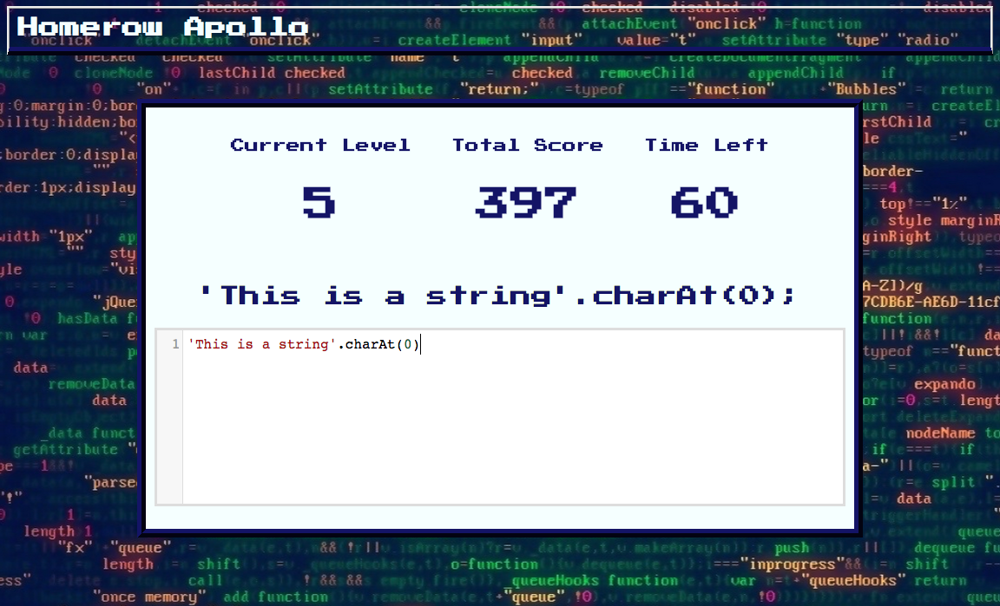

# SpeedCoder - The Multiplayer Version of Homerow Apollo



## What is it? ##

Once you enter SpeedCoder, you will be set against an opponent. Each player will receive the same prompt, and a time limit to complete the prompt under. The faster you complete the prompt, the more points you will earn. Once both players are done with a challenge, they will move on to the next one. The series of challenges that the players receive are randomized from the server, so this is not a memory game. The winner will forever lord over their opponent as the superior typer of code and thus a better person in all measurable ways.

## How to Get Started ##

Install dependencies:

1. From root directory, run ```npm install```.
2. From root directory, run ```bower install```.

Seeding the Database with Challenges and Game records:

1. In your Terminal, navigate to the `server/` directory.
2. Enter the mongo shell by typing 'mongo' and hitting enter.
3. Create or switch to the database that you wish to use with Homerow Apollo with the ```use``` command (for example, ```use apollo```).
4. Seed the database with challenges by entering the following: ```load('fixtures/challenge.js')```
5. Seed the database with game records by entering the following: ```load('fixtures/game.js')```
6. Exit the mongo shell with ctrl+c
7. Run the server and open the browser to localhost:8080

## Tools ##

- Angular
- Sass
- Bower
- Express
- Mongoose
- Node.js
- Grunt
- Morgan
- Method-Override
- Body-Parser
- CodeMirror
- Karma / Mocha / Chai / ng-mock (Unit Tests)
- Protractor / Jasmine (End to End Tests)

## Stretch Features

- Allow more than 2 players per match
- Implement one-click bragging messages delivered to opponent upon victory
- Create more challenges
- Report of words per minute or other performance breakdown
- Find source for challenge content
- Option to play Game with other programming languages
